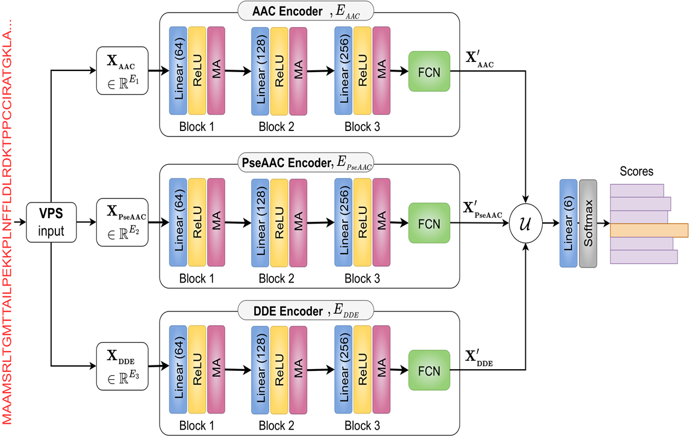

# E-MuLA: An Ensemble Multi-Localized Attention Feature Ex-traction Network for Viral Protein Subcellular Localization
#### Implementation of E-MuLA network (the rest of the files will be uploaded soon.)

<! --- Dataset link: [Viral Protein Subcellular Localization (VPSL)](https://www.dropbox.com/scl/fi/fgtj1qbxhvq48yvkvvtri/Viral-Protein-Subcellular-Localization.zip?rlkey=nbr50owbblin3qrj9ftvo8bxb&dl=0) -->
